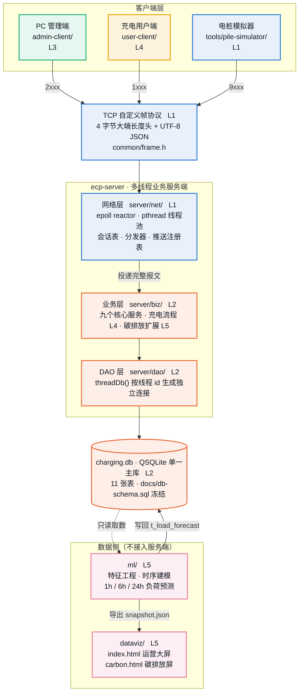

# 系统架构与责任归属

> 电动汽车充电桩管理平台 · 课程设计
> 按 2026-09-09 仓库实测绘制。全项目 **20,115 行**代码，43 个命令字（核心 35 + 扩展 8），核心 11 张数据表 + 扩展 3 张。

## 1. 人员分工

| 工作线 | 负责人 | 负责范围 | 代码规模 |
| --- | --- | --- | --- |
| **L1** 服务端通信与并发 | （姓名） | `common/`、`server/net/`、`tools/` | 2,089 行 |
| **L2** 数据存储与业务服务 | （姓名） | `server/biz/`、`server/dao/`、`docs/db-schema.sql` | 2,042 行 |
| **L3** PC 服务器管理端 | （姓名） | `admin-client/`、`scripts/` | 4,839 行 |
| **L4** 充电用户端 | （姓名） | `user-client/`、充电流程服务 | 2,488 行 |
| **L5** 数据可视化与机器学习 | （姓名） | `ml/`、`dataviz/`、碳排放扩展模块 | 8,657 行 |

每条线除本职模块外另挂一项团队职责：L1 契约维护、L2 评审组织、L3 集成与构建、L4 测试与回归、L5 配置管理与文档归档。

## 2. 架构图

> 该图在 GitHub 上可直接渲染。若渲染环境不支持 Mermaid，可参照下一节的分层说明理解结构。

## 3. 分层说明

一次请求的完整路径：**客户端 → TCP 帧 → 网络层切帧 → 线程池跑业务 → DAO → SQLite**。

### 客户端层

| 模块 | 归属 | 内容 |
| --- | --- | --- |
| `admin-client/` | L3 | PC 管理端，六个功能页：数据总览、电站管理、电桩管理、用户管理、订单管理、负荷预测 |
| `user-client/` | L4 | 充电用户端，五个页签：附近电桩、导航、充电、我的、登录 |
| `tools/pile-simulator/` | L1 | 电桩模拟器，模拟设备注册、状态与电量上报、接收下发指令 |

### 传输层

自定义 TCP 帧协议，**4 字节大端长度头 + UTF-8 JSON 体**。TCP 是字节流没有消息边界，收发一律走 `common/frame.h` 的编解码器，粘包与半包在网络层处理干净，业务代码只看到完整的一帧。

### 服务端 `ecp-server`

| 层 | 目录 | 归属 | 内容 |
| --- | --- | --- | --- |
| 网络层 | `server/net/` | L1 | 主线程 Qt 事件循环负责 accept；独立 epoll IO 线程统一收发与切帧；pthread 线程池执行业务；另有会话表、命令字分发器、设备与用户推送注册表 |
| 业务层 | `server/biz/` | L2 | Dispatcher 注册全部业务 handler，覆盖用户、钱包、电站、电桩、预约、订单、计费、统计等 |
| DAO 层 | `server/dao/` | L2 | `threadDb()` 按线程 id 生成独立 SQLite 连接，禁止跨线程共享 |

### 数据层

`charging.db`，QSQLite 单一主库，11 张表，图片只存文件路径。表结构 `docs/db-schema.sql` 为冻结契约，非属主只读。

### 数据侧

`ml/` 只读数据库，完成特征工程与时序建模，预测未来 1h / 6h / 24h 的充电负荷、空闲桩数与高峰时段，结果写回 `t_load_forecast`，并导出 JSON 快照供 `dataviz/` 大屏轮询。

## 4. 目录归属明细

| 目录 | 属主 | 内容 | 规模 |
| --- | --- | --- | --- |
| `common/` | L1 | 冻结契约：命令字表、帧编解码、错误码、日志、时间工具 | 8 文件 · 539 行 |
| `server/net/` | L1 | epoll reactor、线程池、会话表、分发器、推送注册表、设备服务 | 19 文件 · 1,468 行 |
| `tools/` | L1 | 电桩模拟器 | 1 文件 · 82 行 |
| `server/biz/` | L2 | 业务服务集合 | 14 文件 · 4,686 行 |
| `server/dao/` | L2 | 线程安全的数据库连接分配 | 2 文件 · 77 行 |
| `docs/db-schema.sql` | L2 | 冻结的数据库表结构 | 476 行 |
| `admin-client/` | L3 | PC 管理端六个功能页 | 23 文件 · 5,251 行 |
| `scripts/` | L3 | 一键构建、协议冒烟测试、隔离式集成测试 | 7 文件 · 2,018 行 |
| `user-client/` | L4 | 充电用户端 | 7 文件 · 2,167 行 |
| `ml/` | L5 | 历史数据生成、特征工程、时序建模、预测回写、独立对拍 | 9 文件 · 3,234 行 |
| `dataviz/` | L5 | 运营大屏与碳排放大屏 | 2 文件 · 593 行 |

## 5. 跨目录协作

目录归属与实际作者并非完全重合。以下三处为经属主授权的跨目录实现，均做成**独立提交**，便于属主追认或单独回退。

| 文件 | 所在目录（属主） | 实际作者 | 规模 | 说明 |
| --- | --- | --- | --- | --- |
| `server/biz/order_flow_service.cpp` | `server/biz/`（L2） | L4 | 321 行 | 充电起停与结算服务，由用户端作者实现，与前端同步联调 |
| `server/biz/ext_08_carbon_*.cpp` | `server/biz/`（L2） | L5 | 2,400 行 | 碳排放扩展模块的计算核心与 handler，含手算夹具 |
| `admin-client/ext_08_carbon_page.*` | `admin-client/`（L3） | L5 | 1,493 行 | 碳排放报告页与因子对话框，L3 侧仅新增导航登记 |

> 看架构图时的口径：**按颜色认作者，按目录认属主。**

## 6. 命令字分段

核心 35 个命令字分段由 L1 维护在 `common/protocol.h`；扩展 08 的 8 个在 `common/protocol_ext.h`，段内自治。

| 段 | 功能 | 实现方 |
| --- | --- | --- |
| `1001–1006` | 用户登录、资料修改、钱包充值与流水 | L2 |
| `1101–1102` | 附近电站、站内电桩查询 | L2 |
| `1201–1202` · `1206–1207` | 未完成订单校验、预约、取消、订单列表 | L2 |
| `1203–1205` | 开始充电、结束充电、结算 | L4 |
| `1208` | 充电状态主动推送 | L1 |
| `2001` | 管理员登录 | L2 |
| `2101–2103` | 电站列表、新增、详情 | L2 |
| `2111–2112` | 电桩列表、远程重启（下发 9003） | L2 |
| `2201–2202` | 用户模糊搜索、冻结解冻 | L2 |
| `2301–2305` | 营收三指标、趋势、电桩状态分布、订单列表、负荷预测 | L2 |
| `3740–3747` | 碳排放指标、排放因子、报告生成与导出、因子撤销（扩展 08） | L5 |
| `9001–9006` | 电桩注册、状态上报、心跳、下发重启与起停充电 | L1 |

核心 11 张表见 `docs/db-schema.sql`；扩展 08 另建 `t_carbon_factor` / `t_carbon_daily` / `t_carbon_report`（`docs/db-schema-ext-08.sql`，幂等，随构建自动执行）。

错误码集中在 `common/error_code.h`，扩展模块错误码另置于 `common/error_code_ext.h`，通过函数指针挂钩注入，冻结文件不反向依赖扩展。

## 7. 关键设计决策

| 决策 | 理由 |
| --- | --- |
| **大屏不接入服务端**，改为只读导出 JSON 快照、浏览器轮询静态文件 | 浏览器连不上自定义 TCP 协议；若为大屏单开 HTTP 服务，服务端就不再是纯 Socket，会破坏说明书的考核点。只读导出使两侧彻底解耦 |
| **网络层用 POSIX 原生 socket + epoll**，不用 QTcpServer | 说明书正文明确要求 Socket 编程；epoll reactor 使单线程即可管理全部连接读写 |
| **并发用 pthread 线程池**，不用 QThread | 说明书 1.6 考核点 |
| **每线程独立数据库连接** | `QSqlDatabase` 跨线程共享会崩；统一加锁又会把并发退化为串行 |
| **金额一律 `qint64` 整数「分」** | 浮点累加会产生误差，八千余笔订单的营收统计必须能对上账；仅显示层除以 100 |
| **协议、错误码、表结构冻结** | 跨模块契约由单一属主维护，非属主只读，变更走流程，避免五条线并行时接口反复漂移 |
| **SQL 一律 `prepare` + 参数绑定** | 防注入，同时避免手工拼接字符串带来的类型错误 |

---

*本文档由仓库实测数据生成：`git shortlog`、目录行数统计、`registerHandler` 调用清单、SQLite 表结构抽查。人员一栏请填入真实姓名后使用。*
*运行方式见 [docs/RUNBOOK.md](docs/RUNBOOK.md)。*
