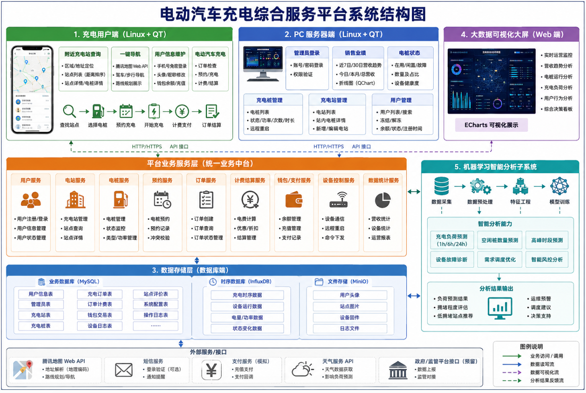

# 电动汽车充电桩应用管理平台

面向电动汽车充电场景的综合管理平台实训项目，覆盖"用户端—服务端—数据端"全业务链路，融合 Linux 系统开发、Qt 跨平台 UI、数据库设计与大数据可视化等技术。

## 项目目标

- 完整体验从需求理解、整体/详细设计、开发、测试到发布的软件工程全流程
- 掌握 Linux 系统下的应用程序开发方法与 Qt Creator 工具链
- 掌握 Qt 图形库进行 UI 设计的能力
- 掌握 Linux 下多线程（pthread）编程与 Socket 通信编程方法
- 培养快速学习新技术、独立解决问题的能力

## 系统架构

系统由五大子系统构成，通过统一业务服务层对接数据存储层与外部服务：



### 1. 充电用户端（Linux + Qt）

模拟手机端交互，为车主提供充电全流程服务：

- **附近充电站查询**：区域/地址定位（模拟 GPS），调用腾讯地图 Web API 解析坐标，按距离排序展示站点及电桩详情
- **一键导航**：调用腾讯地图 Web API（QWebEngineView），支持驾车/步行路线规划
- **用户信息维护**：手机号免密登录（无则自动注册），头像/昵称修改，钱包余额充值（模拟支付）
- **电动汽车充电**：预约充电 → 开始充电 → 计费结算 → 订单结算的完整流程，进入前自动校验是否有未结算订单

### 2. PC 服务器端（Linux + Qt）

面向运营管理人员的宽屏后台系统，以表格、图表为主：

- **管理员登录**：账号/密码校验（默认 admin / 123456）
- **销售业绩**：近 7 日/30 日营收趋势（QChart），今日/本月/总营收核心指标
- **电桩状态**：在用/闲置/故障分布统计
- **充电桩管理**：电桩列表、状态/功率/次数/时长，支持远程重启
- **充电站管理**：站点列表、站内电桩详情、新增电站
- **用户管理**：用户列表、按手机号模糊搜索、冻结/解冻账号

### 3. 数据库端

承担全部业务数据的存储与管理，包括用户信息、充电站信息、充电桩信息、充电订单、管理员账号等。

### 4. 大数据可视化大屏（Web 端）

基于 ECharts 构建的实时运营决策看板，覆盖营收趋势、电桩运行、充电负荷、用户行为等多维分析。

### 5. 机器学习智能分析子系统

基于历史充电时段、时长、电量及天气、节假日等多维数据训练时序模型，实现：

- 未来 1h / 6h / 24h 充电负荷、空闲桩数量、高峰时段预测
- 用户端优先推荐低拥堵高空闲率站点，运营端提前预警调度

## 技术栈

| 类别 | 技术 |
| --- | --- |
| 客户端/服务端 UI | Qt 框架 |
| 核心逻辑 | C++ |
| 业务数据存储 | QSQLite（说明书基础要求）|
| 网络通信 | Socket 编程 |
| 并发模型 | 多线程（pthread） |
| 数据可视化大屏 | Web + ECharts |
| 外部服务 | 腾讯地图 Web API、短信服务、支付服务（模拟）、天气 API |

## 开发环境

- 运行系统：VMware 17，Ubuntu 22.04 及以上
- 开发工具：Qt Creator 6.2 及以上

## 项目文档

详细需求、界面参考图与系统结构图见 [docs/project-spec.md](docs/project-spec.md)。

## 目录结构

```
.
├── docs/                     # 项目说明书与设计资料
│   ├── project-spec.md
│   ├── protocol.md           # 通信协议（冻结契约，属主 L1）
│   ├── db-schema.sql         # 数据库结构（冻结契约，属主 L2）
│   ├── conventions.md        # 规范与变更记录（SCML 维护）
│   └── assets/project-spec/  # 界面参考图、系统结构图
├── common/                   # 全项目共享基座（冻结契约，属主 L1）
├── server/                   # 业务服务端  net/=L1  biz/ dao/=L2
├── admin-client/             # PC 管理端           L3
├── user-client/              # 充电用户端         L4
├── dataviz/                  # ECharts 大屏       L5
├── ml/                       # 机器学习与数据生成  L5
├── tools/pile-simulator/     # 电桩模拟器         L1
├── config/                   # 本地配置模板（app.ini 不入库）
├── scripts/                  # check-env.sh 环境自检 / build-all.sh 一键构建
├── ev-charging-platform.pro  # 顶层 qmake 工程
├── CLAUDE.md                 # 全组 agent 共享上下文
├── AGENTS.md                 # Codex 等工具入口，内容以 CLAUDE.md 为准
├── DIVISION-OF-LABOR.md      # 团队分工方案
├── WORKFLOW.md               # 日常开发流程（agent 使用步骤）
└── README.md
```

> 代码目录（用户端 / 服务器端 / 数据可视化大屏 / 机器学习子系统）待后续开发中补充。

## 开发体制

项目按 PM / TL / PRL / SCML / PE 的实训角色分工推进，具体职责说明见项目说明书 [1.7 开发体制](docs/project-spec.md#17-开发体制)。

五人编制的具体任务划分、技术基线、以及全员 agent 辅助开发下的协作约束，见 [分工方案](DIVISION-OF-LABOR.md)。

开发前请先阅读 [CLAUDE.md](CLAUDE.md)（使用 Codex 的成员从 [AGENTS.md](AGENTS.md) 进入），其中的技术基线、目录归属与硬性规则适用于全组；日常怎么配合 agent 干活见 [开发流程](WORKFLOW.md)。

## 快速开始

```bash
bash scripts/check-env.sh        # 环境自检（先跑这个）
bash scripts/build-all.sh        # 一键构建 + 建库 + 生成 config/app.ini

./build/bin/ecp-server           # 服务端（先启动）
./build/bin/ecp-admin            # PC 管理端
./build/bin/ecp-user             # 充电用户端
./build/bin/ecp-pile-sim SZ001-01   # 电桩模拟器
```

大屏：`python3 ml/export_snapshot.py && python3 -m http.server 8080 -d dataviz`

> **技术选型约定**：一律以说明书**正文文字说明**为准，系统结构图仅作模块与界面参考，不作为选型依据。全部文档与代码注释用 `[说明书]` / `[本组自定]` 两个标记区分「说明书明文要求」与「本组自行决定」。
